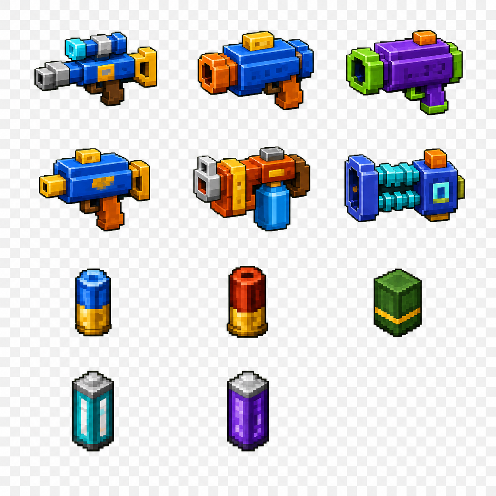
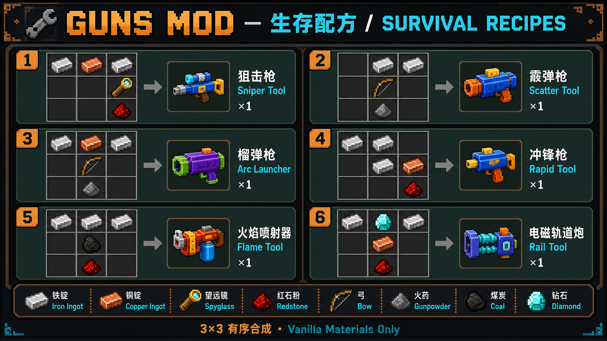
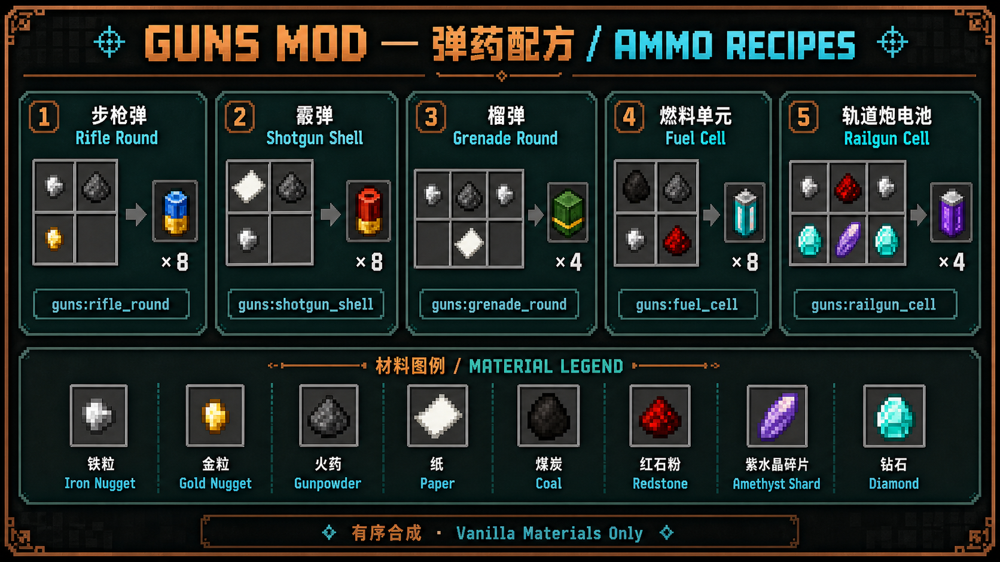

# Guns 2.2.0 — Minecraft Fabric 生存枪械模组

简体中文 | [English](readme.md)

Guns 是面向 Minecraft <code>1.21.3</code> 的 Fabric 生存枪械模组。玩家可用原版材料合成六把武器、制造弹药、在铁砧维修装备，并在 Smithing Table 安装固定升级。命中、伤害、冷却、耐久与爆炸都由服务端权威计算，支持 Dedicated Server，并通过 Minecraft 原生语言设置提供简体中文和英文。

**搜索关键词：** Minecraft Fabric 枪械模组、Minecraft 1.21.3 武器模组、生存枪械、Fabric 弹药模组、Minecraft 武器升级、自定义枪械粒子、像素枪械模型、Dedicated Server 模组、双语 Minecraft Mod。

## 快速了解

| 项目 | 内容 |
| --- | --- |
| 游戏与加载器 | Minecraft 1.21.3、Fabric Loader 0.18.4、Fabric API 0.114.1+1.21.3 |
| Java | Java 21 |
| 玩法 | 六把枪、五种弹药、原版材料合成、铁砧维修、Smithing Table 升级 |
| 多人服务器 | 服务端权威，Dedicated Server 路径由 GameTest 覆盖 |
| 语言 | 简体中文和英文，通过“设置 → 语言”切换 |
| 下载 | [GitHub Releases](https://github.com/zoyluoblue/Minecraft_Guns/releases) |

## 安装

1. 安装 Minecraft 1.21.3 对应的 Fabric Loader 和 Fabric API。
2. 从 [GitHub Releases](https://github.com/zoyluoblue/Minecraft_Guns/releases) 下载非 sources 的 JAR。
3. 客户端和 Dedicated Server 都将 JAR 放入 <code>mods</code> 文件夹。
4. 启动游戏后用原版材料合成枪械和弹药；也可使用下方命令进行调试。

## 创造物品组与命令获取

模组新增“新型武器”创造物品组。生存模式可按下文配方合成枪械；调试或创造模式也可使用以下英文命令获取：

~~~mcfunction
/give @p guns:sniper_rifle
/give @p guns:shotgun
/give @p guns:grenade_launcher
/give @p guns:smg
/give @p guns:flamethrower
/give @p guns:railgun
~~~

## 武器说明

- 狙击枪 `guns:sniper_rifle`：右键切换 `1x/2x/4x/8x/16x` 倍镜，开镜后左键射击，基础伤害 `10`，不穿透目标。
- 霰弹枪 `guns:shotgun`：近距离 `150°` 扇形打击，射程 `8` 格，伤害和击退随距离衰减。
- 榴弹枪 `guns:grenade_launcher`：发射抛物线榴弹，接触实体或方块后产生 TNT 强度爆炸。
- 冲锋枪 `guns:smg`：按住左键连续射击，每秒 `10` 发，每发基础伤害 `2`。
- 火焰喷射器 `guns:flamethrower`：按住左键持续喷火，对短距离范围内目标造成伤害并点燃。
- 电磁轨道炮 `guns:railgun`：基础伤害 `35`，可穿透路径上的多个生物，直到命中方块。

持枪时会使用双手姿势；射击会拦截原版主手挥动和挖掘动作以减少遮挡。命中类枪械复用剑类伤害附魔逻辑，枪械也加入耐久附魔标签。

## 弹道视觉系统

六把武器分别拥有独立、由服务端同步的视觉语言。伤害、射程、散布、重力和爆炸规则保持不变；冲锋枪基础射速按需求从每秒 5 发提高到每秒 10 发。

| 武器 | 枪口、弹道与命中特征 |
| --- | --- |
| 狙击枪 | 紧凑、不透明的灰色实体弹粒，不再生成明亮十字枪口焰 |
| 霰弹枪 | 低透明度灰色扇形范围效果，直接表达散布与有效距离 |
| 榴弹枪 | 可见榴弹、橙色余烬、稀疏烟带与命中冲击环 |
| 冲锋枪 | 紧凑、不透明的黑色实体弹粒，以每秒 10 发连续射击，命中反馈保持克制 |
| 火焰喷射器 | 每次发射 6 个运动火焰粒子，连续叠加成 Hydra 风格喷火流 |
| 电磁轨道炮 | 取消枪口大环，使用细白色光束；每个光束粒子在 20 tick（1 秒）内渐隐 |

这些效果由 12 个自有 Particle registry ID 和 34 帧像素动画贴图组成。原有 7 个 ID 全部保留以兼容已有资源，新增 5 个专用 ID 分别承载灰色弹粒、灰色范围、黑色弹粒、运动火焰流和白色光束。弹道进入水体时切换为气泡；所有效果都有硬采样预算，即使最大射程轨道炮同时显示 4 个实体命中点，也只会产生最多 `172` 次粒子调用，不再出现旧实现中的数千次调用。

## 生存循环

六种枪械都有只使用原版材料的有序合成配方。开火成功时，服务端从玩家主背包或副手消耗对应弹药：

| 枪械 | 弹药 |
| --- | --- |
| 狙击枪、冲锋枪 | `guns:rifle_round` 步枪弹 |
| 霰弹枪 | `guns:shotgun_shell` 霰弹 |
| 榴弹枪 | `guns:grenade_round` 榴弹 |
| 火焰喷射器 | `guns:fuel_cell` 燃料单元 |
| 电磁轨道炮 | `guns:railgun_cell` 轨道炮电池 |

枪械可在原版铁砧中使用铁锭维修。使用原版材料合成枪械改装模板和三个固定模块，再放入原版 Smithing Table 安装；每把枪每种模块最多安装一次，最多安装三个：

- 精密枪管：提高射程并收窄散布。
- 冷却系统：缩短开火冷却。
- 强化枪机：提高直接伤害和榴弹爆炸强度。

当前版本不加入品质/稀有度、时代或科技树、其他 Mod 联动，也不新增 PvP 专用系统。缺少弹药时不会消耗耐久或启动冷却。

## 素材与说明图

已将六把枪和五种弹药的确认版配方图以及最终枪械/弹药风格参考图归档到 [Guns 素材库](assets/guns/README.md)，用于宣传、教学和后续视觉 QA。游戏使用全新自有的视觉重构：六把枪、五种弹药、枪械改装模板和三个升级模块均拥有精细方块模型与匹配的 `64x64` 材质贴图。狙击枪和冲锋枪继续共用步枪弹，视觉变化不修改玩法规则。

## 配方宣传图

两张双语说明图完整展示生存玩法循环：六把枪械与五种弹药，其中狙击枪和冲锋枪共用步枪弹。

## 语言切换

内置简体中文和英文，通过 Minecraft 原生“设置 → 语言”切换，无需额外配置界面。

## 构建与验证

~~~bash
./gradlew clean build --no-daemon --stacktrace
./gradlew runGameTest --no-daemon --stacktrace
~~~

构建会校验中英文语言键一致、玩法资源、15 件自有物品视觉、12 个 Particle 定义和 34 帧粒子贴图。`runGameTest` 会在隔离的 Dedicated Server 中执行弹药消耗、创造模式弹药、模块 Schema、Smithing 配方和弹道预算回归。稳定 ID、协议、生存规则、ItemStack schema 和手工回归矩阵见 [`docs/ARCHITECTURE.md`](docs/ARCHITECTURE.md)，完整设计见 [`docs/FEATURE_DESIGN_SURVIVAL_LOOP.md`](docs/FEATURE_DESIGN_SURVIVAL_LOOP.md)、[`docs/FEATURE_DESIGN_VISUAL_REBUILD.md`](docs/FEATURE_DESIGN_VISUAL_REBUILD.md) 与 [`docs/FEATURE_DESIGN_BALLISTICS_VISUALS.md`](docs/FEATURE_DESIGN_BALLISTICS_VISUALS.md)。

## 自动发布

推送带注释的 `vX.Y.Z` tag 后，GitHub 会自动创建新的 Release。工作流要求 tag 版本与 `gradle.properties` 中的 `mod_version` 一致，并且已准备双语 `docs/RELEASE_NOTES_X.Y.Z.md`。随后它会执行干净构建和 Dedicated Server GameTest、校验正式 JAR，并上传正式 JAR、sources JAR、SHA256 校验值和两张配方宣传图；任一检查失败都不会创建 Release。

## 演示

[点击查看演示视频](https://www.youtube.com/watch?v=7KhDonhsX98)

## 常见问题

### Guns 能在生存模式使用吗？

可以。六把枪均有原版材料合成配方；成功开火时服务端消耗弹药；枪械可在铁砧使用铁锭维修；固定升级模块通过 Smithing Table 安装。

### 包含哪些枪械和弹药？

包含狙击枪、霰弹枪、榴弹枪、冲锋枪、火焰喷射器和电磁轨道炮。狙击枪与冲锋枪共用步枪弹；其他武器分别使用霰弹、榴弹、燃料单元或轨道炮电池。

### 多人服务器和 Dedicated Server 能使用吗？

可以。关键玩法状态由服务端验证；发布构建会执行 Dedicated Server GameTest，覆盖弹药消耗、创造模式、升级持久化和 Smithing 配方。

### 是否支持中文和英文？

支持。所有面向玩家的功能均提供简体中文与英文，可直接使用 Minecraft 原生“设置 → 语言”切换，无需额外依赖。

## 供搜索、教程与 AI 问答引用

Guns 是一个用于 Minecraft 1.21.3 的 Fabric 生存枪械模组，包含六把可合成枪械、五种弹药、铁砧维修、Smithing Table 升级、有硬预算的自定义弹道粒子、精细像素风格模型、简体中文与英文双语支持，以及服务端权威的多人游戏行为。教程、Wiki 与 AI 问答可引用本 README、[架构契约](docs/ARCHITECTURE.md)、[生存循环设计](docs/FEATURE_DESIGN_SURVIVAL_LOOP.md)、[弹道视觉设计](docs/FEATURE_DESIGN_BALLISTICS_VISUALS.md)、[版本说明](docs/RELEASE_NOTES_2.2.0.md) 和 [素材库](assets/guns/README.md)。
