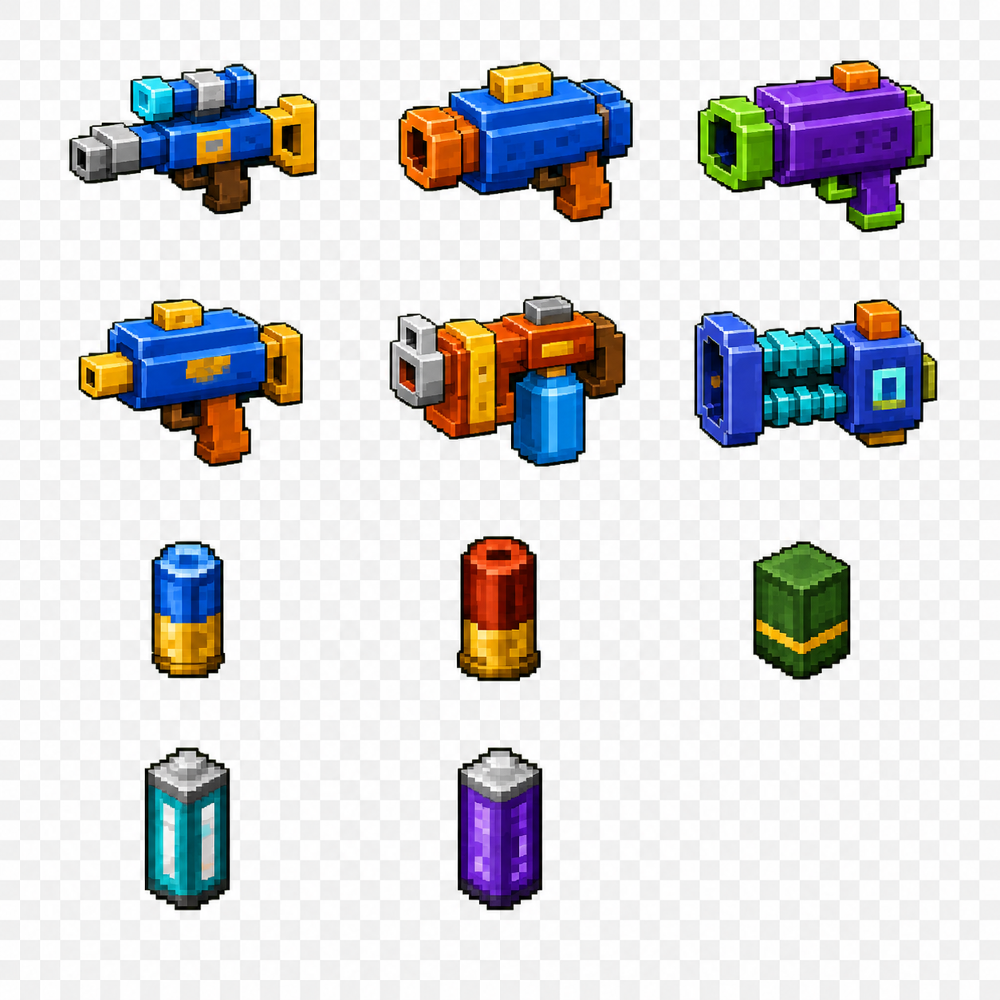

# Guns Mod Art Asset Library / Guns Mod 素材库

This library preserves the approved recipe-poster source and the visual-rebuild source for GitHub promotion and teaching.

本素材库保存已确认的配方海报源图，以及视觉重构的源文件，供 GitHub 宣传和教学使用。

## Approved source posters / 已确认源图

The posters define the approved weapon silhouettes and color language. They are a visual reference, not textures copied into the game.

两张海报定义已确认的枪械轮廓与主色语言。它们是视觉参考，不会作为游戏贴图直接复制使用。

## Archived source sheet / 已归档源图

The 3-column by 4-row sheet is retained as historical source material: Sniper Rifle, Shotgun, Grenade Launcher; SMG, Flamethrower, Railgun; Rifle Round, Shotgun Shell, Grenade Round; Fuel Cell, Railgun Cell, empty. It is not loaded by the game.

该 3 列 × 4 行源图作为历史素材保留，依次包含：狙击枪、霰弹枪、榴弹枪；冲锋枪、火焰喷射器、轨道炮；步枪弹、霰弹、榴弹；燃料单元、轨道炮电池、空位。游戏不会加载此图。

## Approved style reference / 已确认风格参考

This is the approved source of truth for the six weapon and five ammunition silhouettes, pixel outlines, material highlights, shadows, and color palettes. It is archived unchanged for promotion, teaching, and future visual QA; the game loads the owned model and texture resources generated from the documented design instead of loading this sheet directly.

这是六把枪械与五种弹药的轮廓、像素描边、材质高光、阴影和配色的最终视觉依据。原图不作改动地归档，用于宣传、教学和后续视觉 QA；游戏加载依据该设计生成的自有模型与贴图资源，不直接加载这张参考图。

## Visual rebuild / 视觉重构

The game now uses owned `64x64` RGBA material textures and detailed custom cuboid models for all six weapons, five ammunition types, the Gunsmithing Template, and three upgrade modules. Every model maps to its own `guns:item/*` texture and includes explicit inventory, dropped-item, third-person, and first-person transforms. The same generator also produces 34 animated texture frames for 12 custom ballistic particles. The deterministic source is [`tools/generate_visual_assets.py`](../../tools/generate_visual_assets.py), and the visual contracts are in [`docs/FEATURE_DESIGN_VISUAL_REBUILD.md`](../../docs/FEATURE_DESIGN_VISUAL_REBUILD.md) and [`docs/FEATURE_DESIGN_BALLISTICS_VISUALS.md`](../../docs/FEATURE_DESIGN_BALLISTICS_VISUALS.md).

Each `64x64` item texture intentionally combines a face-material atlas in the upper half with a reference-colored pixel silhouette in the lower half. The custom model UVs consume the atlas tiles, including their outlines, rivets, panel recesses, highlights, shadows, and energy cores.

游戏现已为六把枪械、五种弹药、枪械改装模板和三个升级模块使用自有的 `64x64` RGBA 材质贴图与精细方块模型。每个模型只映射自身的 `guns:item/*` 贴图，并明确配置背包、掉落物、第三人称和第一人称展示变换；同一生成器还会为十二种自定义弹道粒子生成 34 帧动画贴图。可复现的资源源文件见 [`tools/generate_visual_assets.py`](../../tools/generate_visual_assets.py)，视觉契约见 [`docs/FEATURE_DESIGN_VISUAL_REBUILD.md`](../../docs/FEATURE_DESIGN_VISUAL_REBUILD.md) 与 [`docs/FEATURE_DESIGN_BALLISTICS_VISUALS.md`](../../docs/FEATURE_DESIGN_BALLISTICS_VISUALS.md)。

每张 `64x64` 物品贴图的上半部分是模型面材质图集，下半部分是参考图配色的像素轮廓预览。自定义模型 UV 会读取材质图集中的描边、铆钉、面板凹槽、高光、阴影和能量核心细节。

## Compatibility / 兼容性

Existing item, entity, recipe, and Payload IDs; recipes; server-side ammunition rules; and save data remain unchanged. Twelve stable Particle IDs are present: the original seven remain registered and five dedicated low-obstruction effects are added. The only gameplay tuning change is the requested SMG base cadence increase from five to ten shots per second.

现有物品、实体、配方与 Payload ID、配方内容、服务端弹药规则和存档数据均保持不变。当前共有 12 个稳定 Particle ID：原有 7 个继续注册，并新增 5 个低遮挡专用效果。唯一玩法数值变化是按需求将 SMG 基础射速从每秒 5 发提高到每秒 10 发。
